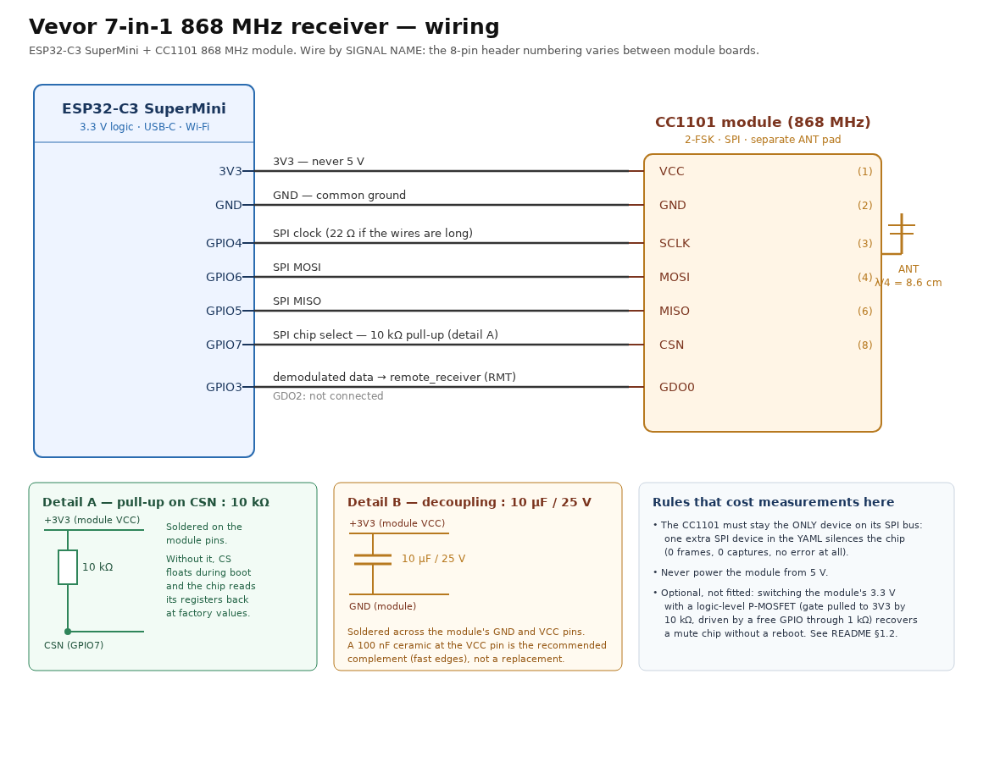

# Vevor 7-in-1 weather station receiver — ESP32-C3 + CC1101 (ESPHome)

An ESPHome firmware that receives a **868 MHz Vevor / Fujian Youtong 7-in-1** weather station and
publishes its measurements to Home Assistant. If all you want is to solder a board and flash it,
this page is all you need — everything else (test tooling, analysis, history, code review) lives in
[`dev/`](dev/README.md).

The station emits a 21-byte frame every 20 seconds. The firmware decodes it from the CC1101's
demodulated output, checks it (header, checksum, counter, physical plausibility) and hands it to
Home Assistant.

---

## 1. What you need

| Item | Note |
|---|---|
| ESP32-C3 | SuperMini or devkit — the firmware targets `board: esp32-c3-devkitm-1` |
| CC1101 module, **868 MHz** | 433 MHz modules are the majority in search results and **do not work** here |
| Antenna for 868 MHz | a 8.2 cm wire is enough to start; the module's coil antenna is very poor |
| 1 resistor **10 kΩ** | between the module's VCC and CSN |
| 1 capacitor **10 µF** (25 V) | between the module's GND and VCC |
| Home Assistant + ESPHome | the **ESPHome Builder** add-on is enough — no local toolchain needed |

---

## 2. Wiring

Full vector version: [`dev/docs/wiring.svg`](dev/docs/wiring.svg). Wire **by signal name, not by
header pin number** (module boards number their 8-pin header differently).

| ESP32-C3 | CC1101 | Signal |
|---|---|---|
| 3V3 | VCC | supply (**never 5 V**) |
| GND | GND | ground |
| GPIO4 | SCLK | SPI clock |
| GPIO6 | MOSI | SPI data out |
| GPIO5 | MISO | SPI data in |
| GPIO7 | CSN | chip select |
| GPIO3 | GDO0 | demodulated data out (feeds the RMT receiver) |
| GPIO10 | GDO2 | not used |

Plus the two components, **soldered on the module's pins**:

* **10 kΩ between VCC (3.3 V) and CSN** — at reset the ESP32-C3's GPIOs are high-impedance, so
  without a pull-up the chip-select line floats during the whole boot and the CC1101 can see
  spurious chip selects. The YAML option `cs_pin: mode: {pullup: true}` does **not** replace it: it
  only takes effect after the pin's `setup()`, i.e. after the boot window.
* **10 µF between GND and VCC** — supply decoupling.

Measured effect of these two: the firmware's own register-write check went from *"1 register
permanently not taken"* to *"0 registers permanently not taken", four cycles in a row*. Before them,
the chip intermittently stayed on its factory register values and demodulated nothing at any
frequency.

A 100 nF ceramic right at the VCC pin, and a supply separate from the board's 3V3 pin, are
recommended but **not required** to get started. Do **not** put anything on the crystal, and do not
touch the RF path between the chip and the antenna.

> **Two hard rules.** Never power the module from 5 V. And the CC1101 must stay the **only** SPI
> device on its bus: a second SPI peripheral — even with a free, unwired CS pin — has been measured
> to make the chip mute.

---

## 3. Flash it

1. In **ESPHome Builder**: *New device* → give it a name → *Skip* the Wi-Fi wizard.
2. Paste the content of [`esphome/vevor-7in1.yaml`](esphome/vevor-7in1.yaml) into the device's
   config. It is self-contained: it pulls its components from this public repository, no file of
   this repo is needed next to it.
3. Create `secrets.yaml` next to it with three keys
   ([`esphome/secrets.yaml.example`](esphome/secrets.yaml.example) gives the exact names):
   `wifi_ssid`, `wifi_password`, `api_key`.
4. **Install** → *Plug into this computer* the first time (USB), then over the air by IP.

Nothing else to configure: the board needs no location, no time zone and no clock.

---

## 4. What it publishes to Home Assistant

All entities below are declared in `esphome/vevor-7in1.yaml`. **`name:` values are French** (changing
them would rename existing entities in an already-running installation) — rename them in the YAML if
you want another language. Automations should bind to the entity `id` and to the published *values*.

### Measurements

| Entity (`name:`) | Type | Unit | Accepted range | What it is |
|---|---|---|---|---|
| `Température extérieure` | sensor, `temperature` | °C | **−40 … +60** | outdoor temperature, 0.1 °C steps, `(raw − 500) × 0.1` |
| `Humidité extérieure` | sensor, `humidity` | % | **0 … 100** | outdoor relative humidity |
| `Vent vitesse moyenne` | sensor, `wind_speed` | km/h | **0 … 180** | average wind speed, `raw / 8.333` |
| `Vent rafale` | sensor, `wind_speed` | km/h | **0 … 180** | wind gust of the frame, `raw / 1.25` (always ≥ average) |
| `Vent direction` | sensor | ° | **0 … 359** | wind direction; the station measures 16 sectors, the frame carries a 12-bit angle |
| `Pluie cumulée` | sensor, `precipitation` | mm | **0 … 15 209.8** | cumulative rain since the last reset, 0.233 mm per tip. Monotone: a rise of more than 5 mm between two frames, and any non-zero decrease, are rejected as corruption; a decrease to zero is accepted (battery change) |
| `Index UV` | sensor | – | **0 … 16** | UV index, `(b15 & 0x1F) − 1` |
| `Luminosité` | sensor, `illuminance` | lx | **0 … 327 670** | illuminance; ×10 when bit 15 of the field is set |

### Status and diagnostics

| Entity (`name:`) | Type | Unit | What it is |
|---|---|---|---|
| `Batterie station faible` | binary_sensor, `battery` | – | low-battery flag of the outdoor sensor |
| `ID station` | sensor (diagnostic) | – | station ID (hex). **It changes when the sensor's batteries are changed** |
| `Compteur TX` | sensor (diagnostic) | – | frame counter, +39 every 20 s (used to detect missed or replayed bursts) |
| `Trames valides` | sensor (diagnostic) | – | frames decoded and published since boot |
| `Trames rejetées` | sensor (diagnostic) | – | candidates whose sync word was seen but which failed validation (checksum / counter / plausibility) — the real noise counter |
| `Captures RMT` | sensor (diagnostic) | – | bursts captured on GDO0 (0 = nothing reaches the chip) |
| `Doublons ignorés` | sensor (diagnostic) | – | burst delivered twice by the RMT within 5 s |
| `Dernière trame brute` | text_sensor (diagnostic) | – | last decoded frame, as received (21 hex bytes) |
| `Dernier verdict` | text_sensor (diagnostic) | – | `ok` or a reason — verdict on the last delivered frame |

### Controls

| Entity (`name:`) | Type | Range | What it is |
|---|---|---|---|
| `Fréquence CC1101` | number (config) | **430 … 930 MHz**, step 0.005 | live radio frequency: scan for the station without reflashing |
| `Dump impulsions` | button (config) | – | logs the raw pulse durations of the next captures (the only way to analyse the real waveform from outside) |
| `Réappliquer la config radio` | button (config) | – | re-runs the radio re-arm sequence (`cc1101.reset`) |
| `Redémarrer la carte` | button (config) | – | reboot — the measured remedy for the mute-chip condition |

Values outside the accepted ranges are **not** published: the frame is rejected and counted instead
(see the plausibility gate in `vevor_protocol.h`). A few counters are visible in the board's log
rather than as entities — among them the rain refusals, which is what to look for if the rain value
ever stops moving when you expect it to rain.

---

## 5. Two things to know before you worry

* **A mute board after a boot is a known state, not a wrong wiring.** On a marginal assembly,
  roughly every other boot brings up a chip that does not answer on the SPI bus at all
  (`Chip ID: 0xFFFF` in the logs). No software recovers it — the firmware restarts the board on its
  own after a few minutes of silence, and a **real power cut** always fixes it. If your board sees
  nothing at all, power-cycle it before suspecting anything else.
* **Rain jumps are refused on purpose.** The rain counter of this station has been observed jumping
  by physically impossible amounts (a measured spike to 7 634.5 mm under a clear sky). The firmware
  now rejects a rise of more than 5 mm between two frames, and any non-zero decrease — both are
  corruption, even when the frame's checksum is valid. A decrease to zero is accepted (battery
  change).

---

## 6. Everything else

| Where | What |
|---|---|
| [`dev/README.md`](dev/README.md) | the detailed document: full entity tables, install and tooling, tests, design notes |
| `dev/docs/` | wiring diagram, design notes, the bit-jitter analysis, Home Assistant forecast rules |
| `dev/tools/` | build, flash, log capture, independent frame evaluation, frequency scan, A/B comparison |
| `dev/tests/` | off-board test suite (independent Python encoder + C++ unit tests, no board needed) |
| `dev/state/` | the full iteration log — what worked, what failed, and why |
| `dev/references/` | the protocol description and the rtl_433 reference source |

The firmware itself is a single ESPHome YAML plus a local `cc1101` component and a `vevor_7in1`
component; the frame decoder lives in `vevor_protocol.h` inside the latter and is testable without
any board.

Licence: see [`LICENSE`](LICENSE). The protocol reference source under `dev/references/` is GPL-2.0.
